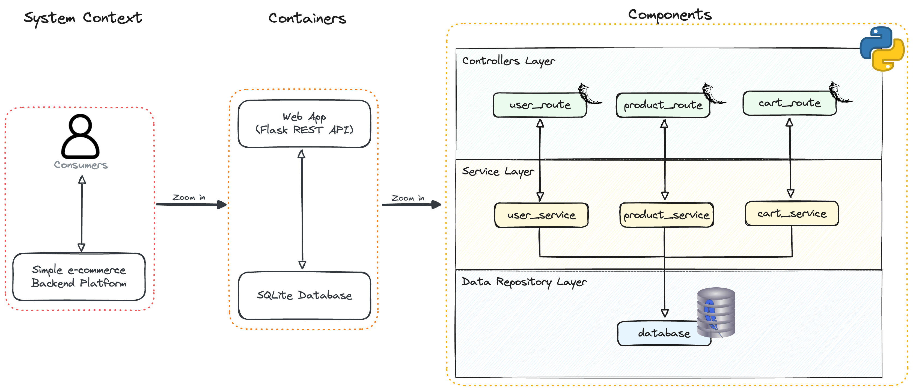

# Simple E-commerce Backend

<p align="center" style="margin: 3em">
  <a href="https://github.com/fsiconha/simple-ecomm">
    
  </a>
</p>

<p align="center">
    <em>Image obtained from www.flaticon.com/free-icon/ecommerce_1145012</em>
</p>

This project is a Flask-based e-commerce backend application. It provides core e-commerce functionality and uses SQLite as the database for persistence (storing data on disk). The choice of Flask (a lightweight Python web framework) and SQLite (a file-based relational database) makes the project easy to set up and run without heavy infrastructure​. Key features of the backend include:

- User Management: Handling user registration, login/authentication, and profile management. The system protects users's passwords by storing them in hashed format.
- Product Management: Creating, updating, and retrieving products in the catalog. This includes endpoints for product listing, viewing details of a single product, editing or deleting products already stored in the base.
- Shopping Cart: Allowing users to add products to a cart, update item quantities, and view the current cart contents. The cart functionality ensures that users can create their list of products with their respective quantities, and then place an order.
- Order Processing: Placing orders from the shopping cart and managing order records. When a user checks out, an order is created capturing items, totals, and user information. The backend handles order creation and updating cart status.

All data for users, products, carts, and orders is stored in a SQLite database. Flask’s routing handles incoming HTTP requests for each of these modules (users, products, carts, orders) and uses the underlying data layer to perform CRUD operations.

## Installation

This project uses **Poetry** to dependencies management. But alternatively, you can set up and run the project using only **Conda**. Feel free to choose whichever way you like (;

### Using Poetry

#### Set Up
```
$ git clone https://github.com/fsiconha/simple-ecomm.git
$ cd simple-ecomm
$ pip install poetry
$ poetry env use python3
$ poetry env activate
$ poetry install
```

#### Run Unit Tests
```
$ poetry run python3 run_unit_tests.py
```

#### Run Integration Tests
```
$ poetry run python3 run_integration_tests.py
```

#### Start App
```
$ poetry run python3 run_app.py
```

#### Access API Docs
```
http://127.0.0.1:5000/apidocs
```

### Using Conda

#### Alternative set up 
```
$ git clone https://github.com/fsiconha/simple-ecomm.git
$ cd simple-ecomm
$ pip install anaconda
$ conda create -n simple-ecomm-env python=3.12
$ conda activate simple-ecomm-env
$ pip install -r requirements.txt
```

#### Run Unit Tests
```
$ python3 run_unit_tests.py
```

#### Run Integration Tests
```
$ python3 run_integration_tests.py
```

#### Start App
```
$ python3 run_app.py
```

#### Access API Docs
```
http://127.0.0.1:5000/apidocs
```

## Solution Approach

- **Layered Architecture**: The application follows a layered architecture design to separate concerns, giving each service a single responsibility. Each layer depends only on the layers beneath it, which creates a clear separation of concerns and leads to a more maintainable codebase​. For example, the routing layer remains independent of the business logic layer and data access layer, making the system easier to extend and test.
- **Readability and TDD**: The codebase emphasizes clean, readable code and was developed with Test-Driven Development (TDD) in mind. By writing tests before the actual code, each piece of functionality is validated by unit tests as it’s built.
- **Unit and Integration Tests**: In addition to unit tests for individual functions, integration tests were written to ensure different modules of the application work together correctly. This type of testing evaluates the interfaces between modules and catches any flaws in how they interact​, giving confidence that the overall system behavior is correct.

## System Architecture

The project leverages a combination of the Service Layer, Repository, and MVC-like patterns.

<p align="center" style="margin: 3em">
  <a href="https://github.com/fsiconha/simple-ecomm">
    
  </a>
</p>

## Additional Features and Considerations

> - **API Documentation (Swagger)**: The API is documented using Swagger (OpenAPI) specifications. An interactive Swagger UI is available to explore the endpoints, which automatically generates up-to-date documentation from the code annotations​.
> - **CI/CD Pipeline**: A Continuous Integration/Continuous Deployment pipeline is implemented with GitHub Actions. On each push or pull request, automated workflows run the project’s test suite (both unit and integration tests) to ensure that new changes do not break existing functionality. Using GitHub Actions makes it simple to automate tasks like running tests and deploying the application directly from the repository​.
> - **Dependency Management**: The project uses Poetry to manage dependencies. All dependencies and their versions are specified in the pyproject.toml file, with exact versions locked in the poetry.lock file. This approach simplifies setup, improves reproducibility, and integrates seamlessly with CI/CD workflows.
> - **Code Style and PEP8**: While the project strives to adhere to clean coding standards, it currently lacks automated PEP8 style validation in the repository. In practice, this means there isn’t yet a tool (like flake8 or Black) integrated into the CI pipeline to catch style issues or enforce formatting. This is acknowledged as a gap; implementing an automated check for PEP8 code style verification is important. Adding a linting step in the future would help keep the codebase uniformly styled and easy to read.
> - **Integration Testing Challenges**: Embracing integration tests came with a learning curve and a extra development time. Additional time was spent designing and implementing these tests, but the effort paid off by uncovering issues in module interactions early and guaranteeing that the overall system components communicate correctly.
- **Future Improvements**: Some improvements are considered for the future:
> - **Containerization**: Structuring the codebase into Docker containers is a planned improvement. Containerizing the Flask app would encapsulate all dependencies and environment configuration, allowing the application to run reliably in any environment. Deploying with Docker would make it easy to replicate the application across different servers or development machines with minimal setup or configuration differences​. This would improve consistency between development, testing, and production environments.
> - **Testing & CI Enhancements**: Expanding the test coverage (both unit and integration tests) and introducing automated PEP8 linting and other static analysis in the CI pipeline would improve code quality. Ensuring PEP8 compliance automatically and possibly adding type checks (with mypy) or security scans are on the roadmap to uphold high standards.
